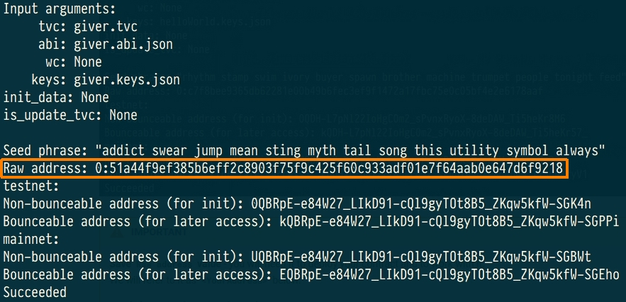
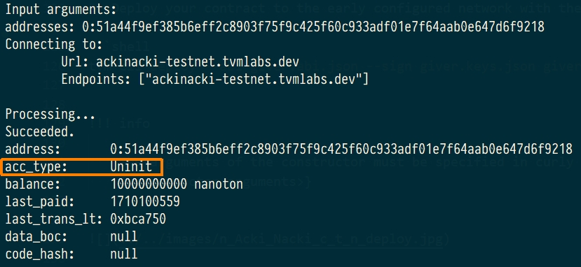
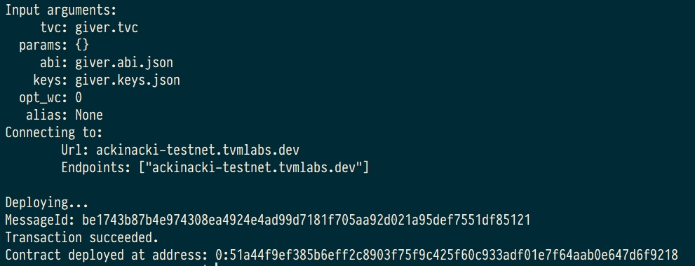
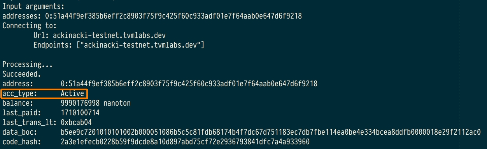

## **Create wallet-contract**


To create your own giver, using any contract of wallet.

For example, create file `giver.sol` with following content:

```solidity
pragma ton-solidity >= 0.35.0;

/// @title Simple wallet
/// @author Tonlabs
contract Wallet {
    // Modifier that allows function to accept external call only if it was signed
    // with contract owner's public key.
    modifier checkOwnerAndAccept {
        // Check that inbound message was signed with owner's public key.
        // Runtime function that obtains sender's public key.
        require(msg.pubkey() == tvm.pubkey(), 100);

        // Runtime function that allows contract to process inbound messages spending
        // its own resources (it's necessary if contract should process all inbound messages,
        // not only those that carry value with them).
        tvm.accept();
        _;
    }

    /*
     * Public functions
     */

    /// @dev Contract constructor.
    constructor() checkOwnerAndAccept { }

    /// @dev Allows to transfer grams to the destination account.
    /// @param dest Transfer target address.
    /// @param value Nanograms value to transfer.
    /// @param bounce Flag that enables bounce message in case of target contract error.
    function sendTransaction(address dest, uint128 value, bool bounce) public view checkOwnerAndAccept {
        // Runtime function that allows to make a transfer with arbitrary settings.
        dest.transfer(value, bounce, 3);
    }
	
    // Function to receive plain transfers.
    receive() external {
    }
}
```


## **Compiling**


Compile this contract using the following [instruction](./create-and-compile-contract.md)

As a result, you will have 4 files:

* `giver.sol` - source code of your wallet-contract;
* `giver.code` - it contains the assembly code of the contract;
* `giver.tvc` - binary code of your contract (the contents of this file will be deployed on network);
* `giver.abi.json` - describe the interface of the contract.


## **Deploy**


Let's deploy the contract to Acki Nacki development blockchain  
at **`ackinacki-testnet.tvmlabs.dev`**


1) Make sure TVM-CLI is in $PATH:

```shell
export PATH=$PATH:<PATH_TO>/tvm-cli

tvm-cli config --url ackinacki-testnet.tvmlabs.dev
```

2) Generate address, keys and seed phrase for your giver:

```shell
tvm-cli genaddr giver.tvc --genkey giver.keys.json
```

Address of your contract in the blockchain is located after `Raw address:`



!!! Warning "IMPORTANT" 

    **Save `Raw address` value** - you will need it to deploy your contract and to work with it.  
    We will refer to it as **`<YourAddress>`** below.  
    
    **Seed phrase** is also printed to stdout.  
    **Key pair** will be generated and saved to the file **`giver.keys.json`**.


!!! danger
    **Write your seed phrase down and store it somewhere safe, and never share it with anyone. Avoid storing it in plain text or screenshots, or any other non-secure way. If you lose it, you lose access to your assets. Anyone who gets it, gets full access to your assets.  
    Also, save the file with a pair of keys in a safe place.**

3) Request test tokens

!!! note 

    Acki Nacki deploy is fee-based, so your new contract will be charged for this.  
    You will need to request some tokens to the address before the actual deployment.  
    Contracts take value in nanotokens.  
    ***(You will need approximately 10 tokens to deploy)***

Please contact us in [Channel on Telegram](https://t.me/+1tWNH2okaPthMWU0) and specify the **`<YourAddress>`**.

4) Check the state of the pre-deployed contract. It should be **`Uninit`**:

```shell
tvm-cli account <YourAddress>
```

You will see something similar to the following:



5) Deploy your contract to the early configured network with the following command:

```shell
tvm-cli deploy --abi giver.abi.json --sign giver.keys.json giver.tvc {}
```

!!! info

    The arguments of the constructor must be specified in curly brackets:  
    `{<constructor arguments>}`




6) Check the contract state again. This time, it is should be `Active`.



## **Request test tokens for future use**

To replenish your giver, please contact us in [Channel on Telegram](https://t.me/+1tWNH2okaPthMWU0).

## **Source code**

You can find full source code of this contract and its artifacts [here](https://github.com/gosh-sh/gosh-examples/tree/main/contracts/simpleWallet)