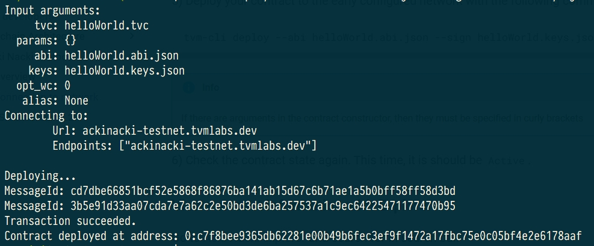

<!-- ## **Quick Start for TVM-CLI** -->

## **Guide overview**

This guide will help you get started with such essential Acki Nacki tools as:

* [TVM-CLI](https://github.com/tvmlabs/tvm-cli)  
* [Solidity Compiler](https://github.com/gosh-sh/TON-Solidity-Compiler)  
* [Acki Nacki Blockchain Explorer](https://ackinacki-testnet.tvmlabs.dev/landing)  
* Node GraphQL API
<!-- TODO added link  -->

You will learn how to:

* Create and compile your first Solidity contract
* Deploy your first contract
* Run it on-chain
* Run a getter-function
* Make a transfer
* Explore contract data in Explorer and GraphQL playground
* Configure your own giver


## **Install TVM-CLI**

Download  and install the TVM-CLI for the platform you need from [here](https://github.com/tvmlabs/tvm-sdk/releases/tag/%40tvmlabs%2Ftvm-cli%400.39.0)


## **Create and compile contract**

Create and compile a contract using the following [instruction](./create-and-compile-contract.md).

As a result, you will have 4 files:

* `helloWorld.sol` - source code of your contract;
* `helloWorld.code` - it contains the assembly code of the contract;
* `helloWorld.tvc` - binary code of your contract (the contents of this file will be deployed on network);
* `helloWorld.abi.json` - describe the interface of the contract.

## **Deploy**

Let's deploy the contract to Acki Nacki development blockchain  
at **ackinacki-testnet.tvmlabs.dev**


1) Make sure TVM-CLI is in $PATH:

```shell
export PATH=$PATH:<PATH_TO>/tvm-cli

tvm-cli config --url ackinacki-testnet.tvmlabs.dev
```

2) Generate address, keys and seed phrase for your contract:

```shell
tvm-cli genaddr helloWorld.tvc --genkey helloWorld.keys.json
```

Address of your contract in the blockchain is located after `Raw address:`


!!! Warning "IMPORTANT" 

    **Save `Raw address` value** - you will need it to deploy your contract and to work with it.  
    We will refer to it as **`<YourAddress>`** below.  
    
    **Seed phrase** is also printed to stdout.  
    **Key pair** will be generated and saved to the file **`helloWorld.keys.json`**.


!!! danger
    **Write your seed phrase down and store it somewhere safe, and never share it with anyone. Avoid storing it in plain text or screenshots, or any other non-secure way. If you lose it, you lose access to your assets. Anyone who gets it, gets full access to your assets.  
    Also, save the file with a pair of keys in a safe place.**

3) Get some test-tokens to your account.


!!! note 

    You will need to send some tokens to the address before the actual deployment. Acki Nacki deploy is fee-based, so your new contract will be charged for this.  
    ***(You will need about 10 tokens to deploy)***

We recommend creating a [wallet-contract](./create-giver.md) that will serve as your giver.

To replenish it, please contact us in [Channel on Telegram](https://t.me/+1tWNH2okaPthMWU0).


4) Check the state of the pre-deployed contract. It should be `Uninit`:

```shell
tvm-cli account <YourAddress>
```

You will see something similar to the following:


5) Deploy your contract to the early configured network with the following command:

```shell
tvm-cli deploy --abi helloWorld.abi.json --sign helloWorld.keys.json helloWorld.tvc {}
```

!!! info

    If there are arguments in the contract constructor, then they must be specified in curly brackets  
    `{<constructor_arguments>}`




6) Check the contract state again. This time, it is should be `Active`.


## **View contract information with Explorer**

Go to [Acki Nacki explorer](https://ackinacki-testnet.tvmlabs.dev/landing) and search for <YourAddress> in search bar.  
Open your account page. You will need it later to see its transactions and messages, that we will produce in the next steps.


## **Explore contract information with GraphQL**

Go to [GraphQL playground](https://ackinacki-testnet.tvmlabs.dev/graphql).  
Enter in the left pane and click Run button (replace the contract's address with the one you got in the previous steps).

```graphql
query {
  accounts(
    filter: {
      id: {
        eq: "<YourAddress>"
      }
    }
  ) {
    acc_type_name
    balance
    code
    code_hash
    data
  }
}
```

You will see something that looks similar following:


!!! info

    **You can specify any other fields in the result section that are available in GraphQL Schema.**  
    Click **`Docs`** on the right side of your screen to explore it.


## **Run a getter function**

for example, the `timestamp` method:

```shell
tvm-cli run <YourAddress> timestamp {} --abi helloWorld.abi.json

```
result:


## **Call function**

for example, the `touch` method:

```shell
tvm-cli call <YourAddress> touch {} --abi helloWorld.abi.json --sign helloWorld.keys.json
```
result:


## **Transfer of tokens from own giver**

```shell
tonos-cli call <giverAddress> sendTransaction '{"dest":"DestAddress", "value":10000000000, "bounce":false}' --abi giver.abi.json --sign giver.keys.json
```

!!! info

    * Contracts take value in nanotokens
    * You will need approximately 10 tokens to deploy the contract
    * **Bounce = true** means that if the recipient does not exist, money will be returned back.  
    If you plan to transfer money for deploy, specify **Bounce = false**!


## **What's next?**

Congratulations, now your contract is up and running!  
Now, you can get acquainted with:

* [Solidity API for TVM](https://github.com/gosh-sh/TON-Solidity-Compiler/blob/master/API.md)
* [more contract samples](https://github.com/tonlabs/samples/tree/master/solidity)

