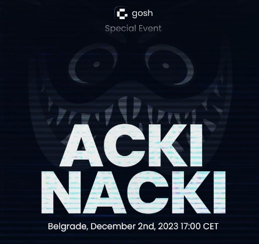

# **Secured! Decentralized! Fast!**

**Acki Nacki is based on** [**consensus research paper**](https://link.springer.com/chapter/10.1007/978-3-031-61486-6_4){:target="_blank"}

**Acki Nacki is asynchronous, highly effective proof-of-stake protocol optimized for fast finality, while allowing for high throughputs via execution parallelization.** It is a probabilistic protocol that achieves higher Byzantine fault tolerance than Nakamoto, BFT (including Hotstuff and AptosBFT), Solana, and other modern consensus protocols. **Our protocol reaches consensus in two communication steps** and has a total number of messages that are subquadratic to the number of nodes, with probabilistic, dynamically adjusted safety guarantees. We trade off deterministic consensus with theoretical constraints on message complexity and the number of Byzantine agreements, with probabilistic algorithms overtaking these boundaries. We further claim that because of the use of randomness and socioeconomics in blockchain designs, no real trade-off is actually present. One of the key ingredients of our approach is **separating the verification of execution by a consensus committee from the attestation of block propagation by network participants**. Our **consensus committee is randomly selected for each block** and is not predetermined, while the Leader is deterministic.

## ***watch the event*** [**here**](https://www.youtube.com/watch?v=WKiVzLMqJAg){:target="_blank"}
